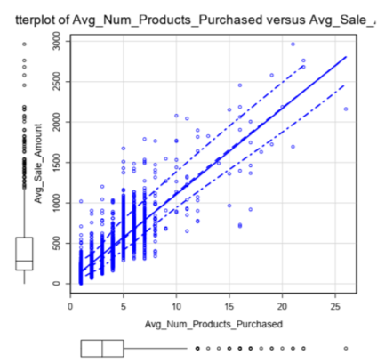
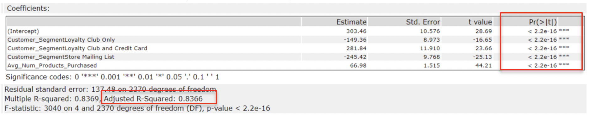

# Predicting Catalog Demand

The purpose of this project was to investigate the data and choose a linear regression to predict the profit for implementing a business decision (sending a catalog to 250 customers).

## *Step 1: Business and Data Understanding*
1.1. _What decisions needs to be made?_
The decision that needs to be made is whether to send a catalog to 250 customers. 

1.2. _What data is needed to inform those decisions?_
The information needed to decide whether to send the catalog or not needs to comprise data about the possible impact that the sending of the catalogs could have. The impact implies the potential profit that would be made through this action. The company wants to know if the profit would exceed $10,000 or not. If it would exceed the target amount, then the company will decide to send the catalogs, otherwise, they will not send them.

## *Step 2: Analysis, Modeling, and Validation*
### _2.1.	How and why did I select the predictor variables in the model?_ 

The potential predictor variables for the model are:
a.	(Customer) Name 	
b.	Customer_Segment	
c.	Customer_ID	
d.	Address	
e.	City	
f.	State	
g.	ZIP	
h.	Store_Number	
i.	Responded_to_Last_Catalog	
j.	Avg_Num_Products_Purchased	
k.	#_Years_as_Customer

Using a (sub)set of these, I want to be able to predict the average sale amount (the target variable) a customer would make. I ruled out without trying to understand whether there is a relationship between them and the target variable the following: Name, Customer_ID, and State. The name and the customer id are not important as we are not interested in who they are, we are interested in their behavior and purchase characteristics which is given by the other variables. We also excluded State as it only contains “CO” value, meaning that this will not distinguish between customers based on the location information given by the state. 

There is only one continuous numeric predictor variable, Avg_Num_Products_Purchased, so I did a scatter plot to see if there could be seen a linear relationship between it and the target variable:

From the scatter plot with average number of products purchased vs. average sale amount it becomes apparent that there is a relationship between the two variables. As expected, the amount increases with number of purchased products, but there’s a lot of variation among amounts with the same number of products. Because of this relationship, I kept average number of products purchased as a predictor variable.

I also eliminated Responded_to_Last_Catalog from the list of predictors as there is no such column in the test data (p1-mailinglist.xls).

For the categorical variables I used a trial and error methodology by analyzing if they are statistically significant according to their p-value: if their p-value was larger than 0.05 I discarded them, and kept them otherwise. Based on this method, I discarded:
-	City, as for all 26 values Alteryx created dummy variables and out of the 26 columns only a couple were slightly related to the target variable. 
-	Store Number as it had a p-value greater than 0.05.
-	Years as Customer as it had a p-value greater than 0.05.
-	ZIP as it had a p-value greater than 0.05.

### _2.2.	Is the model a good model?_ 

I used Alteryx to answer this question as follows:

The report produced with Alteryx is the following:

It can be observed that, for this model, the chosen predictor variables are statistically significant, so we can leave them all in. The adjusted R-squared is 0.8366, which is above 0.7, seems to indicate that the model would yield satisfactory results. While a high r-squared is not a guarantee that the model good, in this case we can have some confidence that our model will explain a lot of the variation in amounts.

### _2.3. The Linear Equation_

Based on the above report, we take the estimate coefficients and input them into the linear regression equation:

amount = 303.46 
        – 149.36 * (Customer_Segment: Loyalty Club Only)
        + 281.84 * (Customer_Segment: Club and Credit Card)
        - 245.42 * (Customer_Segment: StoreMailingList)
        + 0.00 * (Customer_Segment: Credit Card Only)
        + 66.98 * Avg_Num_products_purchased 

*Note*: for the categorical variable Customer Segment the baseline case is Credit Card Only value.

Using the above linear equation, we can now compute the predicted profit.

## Licensing, Authors, Acknowledgements

The data was provided by Udacity as part of a nanodegree. 
The entire code was authored by me so feel free to use it as you may please. For any questions/suggestions, drop me a line at lacramioaramazilu at gmail.com.   