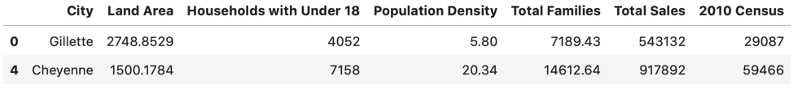
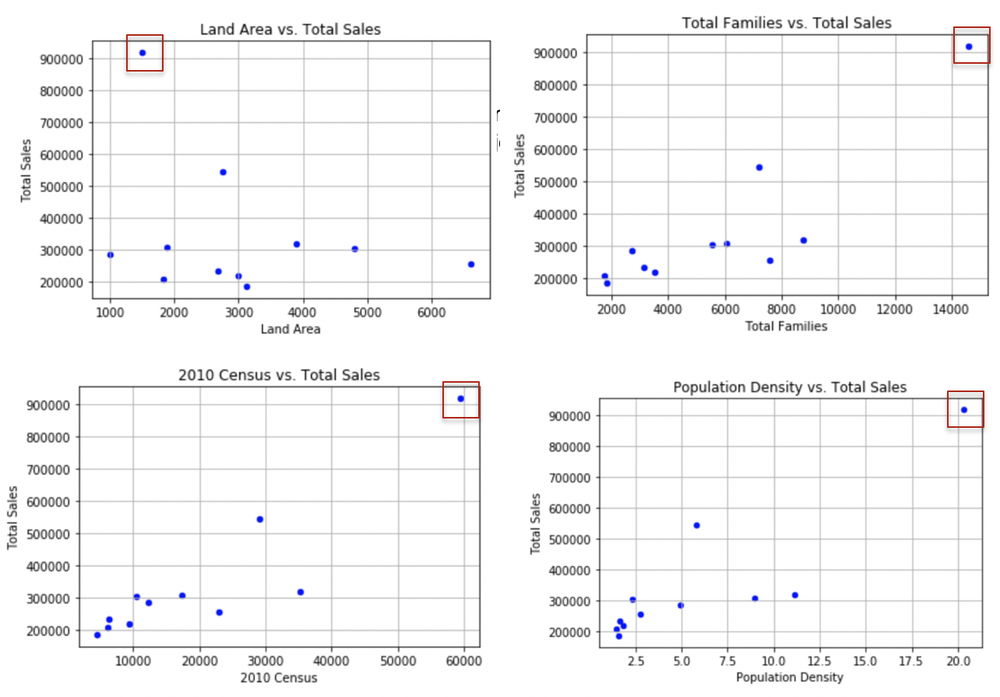

# Data Cleanup

The purpose of this project was to investigate the data and clean (just remove outliers) and prepare it for data analysis tasks.

## * Dealing with outliers*
I chose as an outlier the row where the city is Cheyenne. Below, I outline my methodology to reach this conclusion:

First, I computed the outliers for the Total Sales values. I did this by using the interquartile method, computing the upper fence and the lower fence. Based on the obtained interval, for total sales, I obtained the following two outlier rows:

Considering the small data set (11 rows), I thought it was too much to consider two rows as outliers, so I investigated the outliers on the other values such as Land Area, Total Families, 2010 Census, and Population Density. For these, the only row resulting as outlier was the one for Cheyenne city. In order to confirm that this entry is an outlier, I plotted the above-mentioned columns against the Total Sales column. I did this as I expected to see the point corresponding to Cheyenne city as being an outlier (separated from the other points). Bellow I attached the plots where one can clearly see that in all situations there is only one isolated point, and that point is the one for the Cheyenne city. Given this, I chose to consider this entry as an outlier for the (rather small) dataset.

## Licensing, Authors, Acknowledgements

The data was provided by Udacity as part of a nanodegree. 
The entire code was authored by me so feel free to use it as you may please. For any questions/suggestions, drop me a line at lacramioaramazilu at gmail.com.   