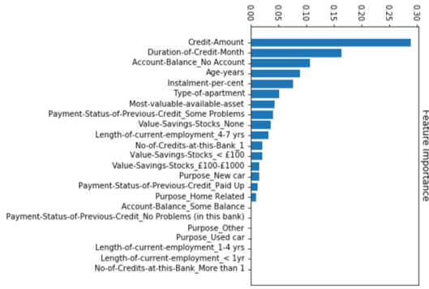
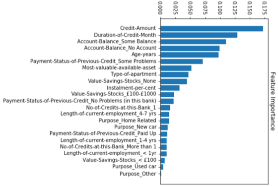
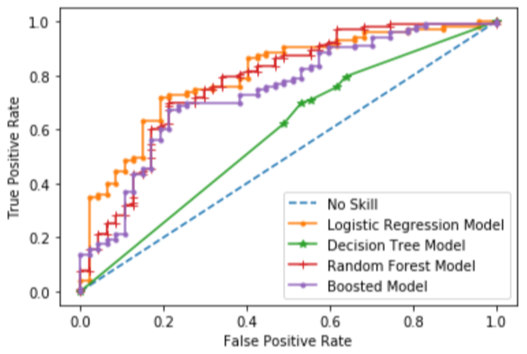

# Predicting Default Risk

## *Step 1: Business and Data Understanding*
1.1. _What decisions needs to be made?_
The decision that needs to be made is whether a new customer should be given a loan or not. Once we determine how to predict for one customer, we need to decide to which of the 500 new customers our bank should give the loan to.

1.2. _What data is needed to inform those decisions?_
The data that is used in order to inform these decisions comprises information about credit history of the current customers of the bank. Based on their characteristics, we need to choose and train a model that uses this information as training data and predict whether the new customers are worthy of a loan.

1.3. _What kind of model (Continuous, Binary, Non-Binary, Time-Series) do we need to use to help make these decisions?_
The model is a Binary Classification model as it needs to predict whether the new incoming customers should be given the loans or not, i.e., positive or negative outcomes.

## *Step 2: Building the Training Set*
I removed from the training set the following:
1.	Duration-in-current-address
2.	Concurrent-Credits 
3.	Occupation
4.	Guarantors
5.	Telephone
6.	Foreign-Worker 
7.	No-of-dependents

### *1.	Dealing with missing information:*
Based on the number of nulls on each column, I could tell that column Duration-in-current-address has sparse data (more than 50% of the values are missing), so I decided to remove the column from the training set.

For Age-years, I chose to fill the missing data with the median of the existing values on the same column. I chose median over mean as mean is susceptible to outliers and the Age years seems to have 19 rows with outliers (computed based on the interquartile method). 

### *2.	Dealing with columns with low variability:*
Based on the number of distinct values on each column, I could tell that columns Concurrent-Credits and Occupation have very low variability as they only have 1 unique value. I decided that to remove these columns from the training set.

Guarantors has 2 unique values, but is skewed towards one of the values so it has low variability.

Also, the Telephone is not information that can be related to credits and it also has low variability (2 unique values), so I discarded that as well

### *3.	Dealing with skewed data:*
For the remaining columns, I computed how skewed the data is and it resulted that columns Foreign-Worker and No-of-dependents contain skewed information. Having skewed data will not affect the training of the model, but will affect during prediction, thus, I decided to eliminate these.

### *4.	Dealing with other correlations:*
For the numerical data, I computed a heatmap that can be seen in the notebook. I observed here that there are no correlations above 0.7 (which can be considered as significant) so I concluded that the variables can be used together as they don’t seem to be correlated to each other.  

## _Step 3: Train your Classification Models_
Here I trained and compared 4 models: Logistic Regression, Decision Tree, Random Forest Model (RandomForestClassifier from sklearn), Boosted Model (GradientBoostingClassifier from sklearn). Below I answer 3 questions for choosing the best model for this task. 

### *3.1 Logistic Regression*
_1)	Which predictor variables are significant or the most important?_

The variables that are most significant are 
•	Account-Balance, 
•	Duration-of-Credit-Month, 
•	Credit-Amount, 
•	Most-Valuable-available-asset. 

_2)	Show the p-values or variable importance charts for all predictor variables._

The p-values are computed in the notebook. 

_3)	Validate your model against the Validation set. What was the overall percent accuracy?_

The overall accuracy was 75.33% on the validation set.

_4)	 Show the confusion matrix. Are there any bias seen in the model’s predictions?_

The overall percent accuracy of the Logistic model is 75.33%, which is strong
PPV= true positives / (true positives + false positives) = 93 / (93+27) = 0.78
NPV= true negatives / (true negatives + false negatives) = 20 / (20+10) = 0.66

The accuracy for the Creditworthy class is 0.78, while for the Non-Creditworthy is 0.66. This means that the model has bias towards correctly predicting Creditworthy individuals because its accuracy in this segment is significantly higher than in the other.  

### *3.2 Decision Tree*
_1)	Which predictor variables are significant or the most important?_

After I ran the decision tree with all 12 variables, I obtained the variable importance in Figure 3. It seems 
•	Credit-Amount
•	Duration of Credit Month
•	Account-Balance-No account 
are the most important predictor variables.

_2)	Show the p-values or variable importance charts for all of the predictor variables._

Variable importance can be found  below.

_3)	Validate your model against the Validation set. What was the overall percent accuracy?_

The overall accuracy was 63.34% on the validation set.

_4)	 Show the confusion matrix. Are there any bias seen in the model’s predictions?_

The overall percent accuracy of the Decision Tree model is 70 %, which is strong
PPV= true positives / (true positives + false positives) = 0.73
NPV= true negatives / (true negatives + false negatives) = 0.41

The accuracy for the Creditworthy class is 0.73, while for the Non-Creditworthy is 0.41. This means that the model has bias towards correctly predicting Creditworthy individuals because its accuracy in this segment is significantly higher than in the other.  

### *3.3 Random Forest Model*
_3.3.1.	Which predictor variables are significant or the most important?_

The scores for variable importance can be seen in 3.3.2. It seems 
•	Credit-Amount
•	Age-Years
•	Duration of Credit Month
are the most important predictor variables.

_3.3.2.	Show the p-values or variable importance charts for all of the predictor variables._

Variable importance can be found below.

_3.3.3.	Validate your model against the Validation set. What was the overall percent accuracy?_

The overall accuracy was 76%.

_3.3.4.	 Show the confusion matrix. Are there any bias seen in the model’s predictions?_ 

The overall percent accuracy of the Random Forest model is 76%, which is strong
PPV= true positives / (true positives + false positives) = 0.78
NPV= true negatives / (true negatives + false negatives) = 0.69

The accuracy for the Creditworthy class is 0.78, while for the Non-Creditworthy is 0.69. This means that the model has bias towards correctly predicting Non-Creditworthy individuals because its accuracy in this segment is significantly higher than in the other.  

### *3.4 Random Forest Model*

_3.4.1.	Which predictor variables are significant or the most important?_

The scores for variable importance can be seen in 3.4.2. It seems 
○	Credit-Amount
○	Duration of Credit Month
○	Account Balance-Some Balance
○	Account Balance-No-Account
○	Age Years

are the most important predictor variables.

_3.4.2.	Show the p-values or variable importance charts for all of the predictor variables._

Variable importance can be found below.

_3.4.3.	Validate your model against the Validation set. What was the overall percent accuracy?_
The overall accuracy was 72.67%.

_3.4.4.	Show the confusion matrix. Are there any bias seen in the model’s predictions?_
The overall percent accuracy of the Boosted model is 72.67%, which is strong
PPV= true positives / (true positives + false positives) = 0.75
NPV= true negatives / (true negatives + false negatives) = 0.62

The accuracy for the Creditworthy class is 0.75, while for the Non-Creditworthy is 0.62. This means that the model has bias towards correctly predicting Creditworthy individuals because its accuracy in this segment is significantly higher than in the other.  

## *Step 4: Analysis*
I have chosen to use the *Random Forest model*. Below, I explain how I reached this conclusion.

### *4.1. Accuracy*
Overall Accuracy against your Validation set
Considering the overall accuracy against the validation set, the Random Forest Model seems to be performing with a 76% accuracy which is the best among the four models. 

Accuracies within “Creditworthy” and “Non-Creditworthy” segments

Boosted model - The accuracy for the Creditworthy class is 0.75, while for the Non-Creditworthy is 0.62.
Random forest model - The accuracy for the Creditworthy class is 0.78, while for the Non-Creditworthy is 0.69.
Decision tree model - The accuracy for the Creditworthy class is 0.73, while for the Non-Creditworthy is 0.41.
Logistic regression model - The accuracy for the Creditworthy class is 0.78, while for the Non-Creditworthy is 0.66.

Considering the accuracies within “Creditworthy” and “Non-Creditworthy” segments, the random forest model seems to performing best in terms of both segments.

### *4.2. ROC graphs*
Below I plotted the ROC curves for the four models.

Logistic Regression Model: ROC AUC=0.8
Random Forest Model: ROC AUC=0.78
Boosted Model: ROC AUC=0.74 
Decision Tree Model: ROC AUC=0.58 

Considering the area under the curve, Logistic Regression model seems to be performing best out of all models as it has the largest ROC AUC (0.8). Nevertheless, second to best is Random Forest with a difference of just 0.02.

### *4.3 Bias in the Confusion Matrices*
In terms of bias in the confusion matrices, all models were biased towards the Creditworthy segment. This could be due to the fact that the training set did not properly (equally) represent both classes so all models were better trained to identify the Creditworthy class.

## Licensing, Authors, Acknowledgements

The data was provided by Udacity as part of a nanodegree. 
The entire code was authored by me so feel free to use it as you may please. For any questions/suggestions, drop me a line at lacramioaramazilu at gmail.com.   