# Analyzing a Market Test

The purpose of this project was to simulate a market test and decide on implementing (or not) a business idea (opening some new stores). 

The project implied usind AB testing. Throughout this project I used Alteryx tool.

## *Step 1: Plan the Analysis 

_1.1.What is the performance metric used to evaluate the results of the test?_
The performance metric that I’ll use is profit (gross margin).

_1.2.	What is the test period?_
The test period is of 12 weeks: from 29 April 2016 to 21 July 2016.
_1.3.	At what level (day, week, month, etc.) should the data be aggregated?_
The data would be aggregated at week level so as to have a finer grained metric for growth in store traffic and seasonal patterns in sales volume.

## *Step 2: Prepare the data*
 This is done with Alteryx. The file is *PreparingData.yxmd*

## Step 3: Match Treatment and Control Units
Create the trend and seasonality variables, and use them along with you other control variable(s) to match two control units to each treatment unit. 

#### _3.1.	What control variables should be considered? (apart from trend and seasonality)_
The two variables that potentially made sense to be considered as control variables were Sq_ft and AverageMonthSales. 
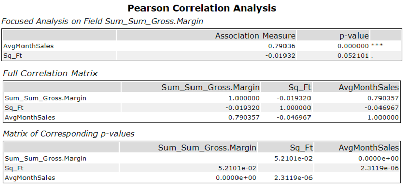

#### _3.2.	What is the correlation between each potential control variable and the performance metric?_
My performance metric is gross_margin. In order to decide which control variables are suitable, I used the Pearson Correlation Analysis where I set the gross_margin as the target variable and computed the correlation values between the target variable and sq_ft and AverageMonthSales. The resulting values can be seen inthe two figures below. 
The correlation between gross margin and sq_ft is -0.02
The correlation between gross margin and AverageMonthSales is 0.79.

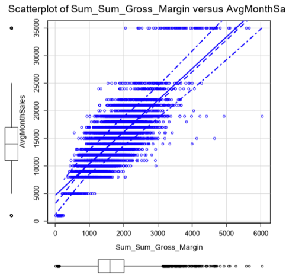

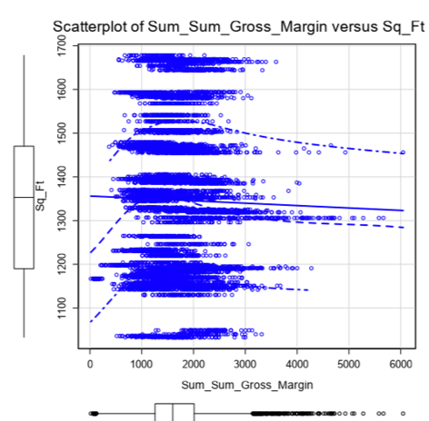

#### _3.3.	What control variables should be used to match treatment and control stores?_
Only AverageMonthSales will be considered together with seasonality and trend to match treatment and control stores. I outline below how I reached this conclusion.

Based on the results in Figures 1, it can be observed that Sq_ft does not seem to be a suitable control variable as its association with the target variable is rather poor (-0.02, with p-value=0.52, which is larger than 0.05) so it will not be considered in the process of matching treatment and control stores. Also, the results in Figure 2 show there is no linear correlation between the two variables.

On the other hand, the AverageMonthSales variable has a strong correlation to the target variable (0.79, with a p-value= 0.00) so it will be considered together with the trend and seasonality to match treatment with control stores. Also, the results in Figure 3 show there is a linear correlation between the two variables.

## Step 4: Analysis 

### _4.1.	Overall results (both regions)_
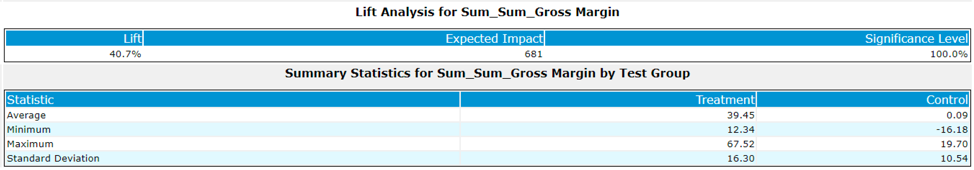

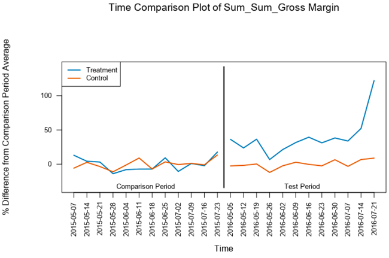

In the above figure, we can observe that a year before (2015), both treatment and control stores performed similarly (left-hand side of the plot). However, for the same period of the year, but next year (2016), the treatment stores performed better compared to a year before and to the control stores. This means that the treatment (adding the menu) had a positive effect on the profit of the stores where it was implemented (relative to the stores where it wasn’t implemented and to the same stores a year before). 

At a finer grained level, we can see results per store in in the below figure. Here, we can observe that in all 10 treatment stores the profit (gross margin) was increased compared to the control stores.
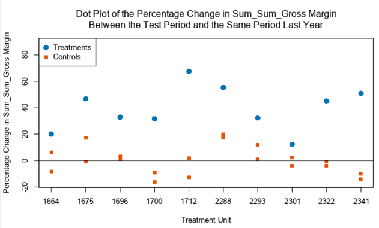

### _4.2. West region results_

From the below figure, we can see that the treatment stores in the West region performed better when compared to the same stores in the same period, but a year before. 
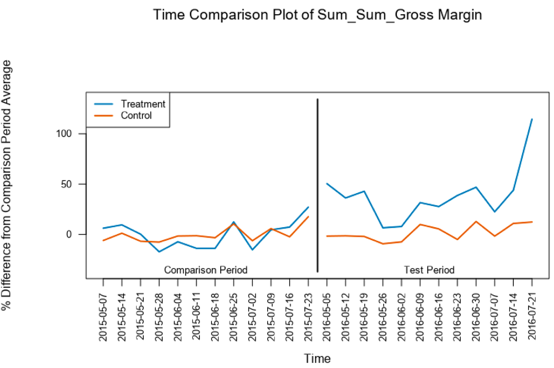

Also, comparing the increase in profit, the treatment stores performed better when compared to similar stores for the same period .
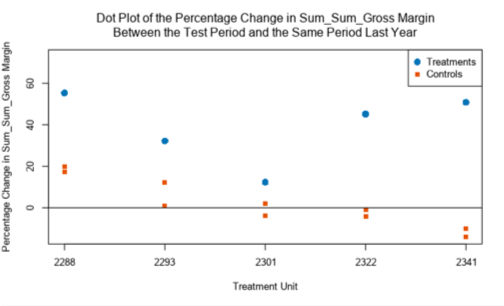

Moreover, below we can see that there was a 37.9% incremental lift for the treatment stores. 
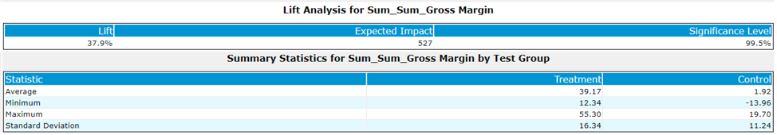

Based on these results, it is safe to recommend to implement the new menu in the other stores similar to the ones where the treatment was applied in the west region.

### _4.3. Central region results_
In the below figure, we can see that the treatment stores in the Central region performed better when compared to the same stores in the same period, but a year before ( comparing the blue lines in the left-hand and right-hand sides).
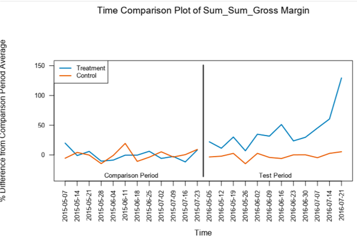

Also, comparing the increase in profit, the treatment stores performed better when compared to similar stores for the same period.
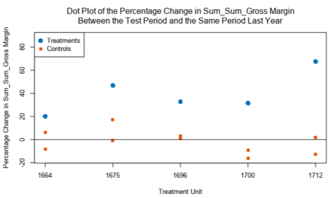

Moreover, below e can see that there was a 43.5% incremental lift for the treatment stores. 
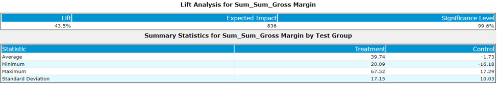
Based on these results, it is safe to recommend to implement the new menu in the other stores similar to the ones where the treatment was applied in the central region.

## Licensing, Authors, Acknowledgements

The data and Alteryx license (temporary) were provided by Udacity as part of a nanodegree. 
